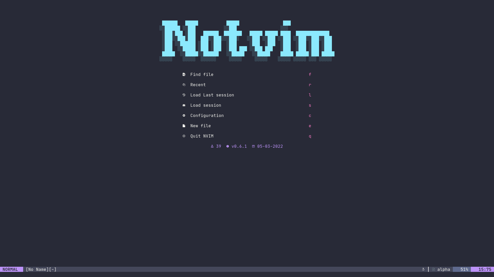
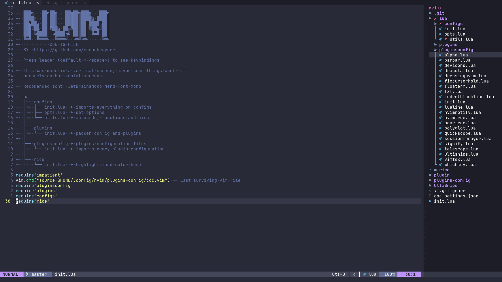
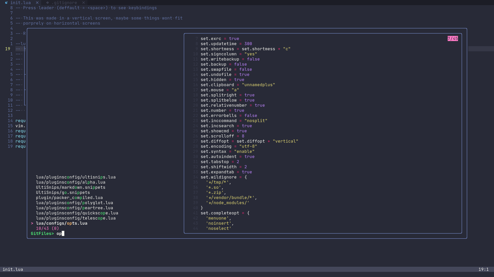
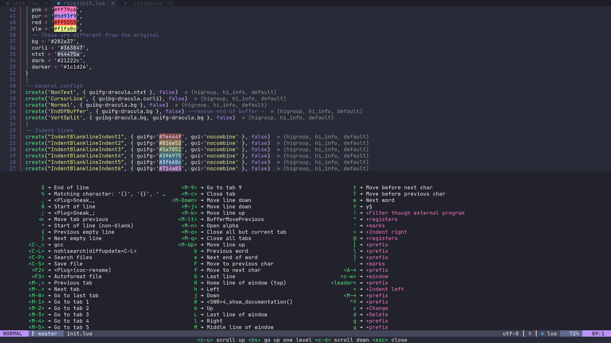

# Notvim
I'm not joking, this is really not *vim*.

## Installation
Nothing fancy here, this is just my config for neovim, just clone the contents of this repo on your ~/.config/nvim.

## Some features

### Alpha:

Highly configurable startpage with multiple shortcuts.
Currently set to: Find files, find recent files, load last session, select session, open the init.lua file, open a empty buffer, quit notvim (really its not vim)

### NvimTree:

File tree plugin, setup to open on the right side, this prevents the code shifting around on the screen and keeps things on its place

### Fzf:

Fuzzy find files, depending on if you are on a git repo or not it will call :Files or :GFiles when pressing Ctrl+p

### Which key:

Preview keybinds in a small floating window at the bottom of definitely not *vim*

## Plugins

List of installed plugins:

  
andrewradev/tagalong.vim

  <h4>Description:</h4>
    The plugin is designed to automatically rename closing HTML/XML tags when editing opening ones (or the other way around). For the most part, you should be able to edit your code normally
  <h4>Repo:</h4>
  <a href="https://github.com/andrewradev/tagalong.vim">Go to repo</a>

  
chiel92/vim-autoformat

  <h4>Description:</h4>
    Format code with one button press (or automatically on save).
    This plugin makes use of external formatting programs to achieve the most decent results.
  <h4>Repo:</h4>
  <a href="https://github.com/chiel92/vim-autoformat">Go to repo</a>

  
shatur/neovim-session-manager

  <h4>Description:</h4>
    A Neovim plugin that use build-in :mksession to manage sessions like folders in VSCode. It allows you to save the current folder as a session to open it later. The plugin can also automatically load the last session on startup, save the current one on exit and switch between session folders.
  <h4>Repo:</h4>
  <a href="https://github.com/shatur/neovim-session-manager">Go to repo</a>

  
sirver/ultisnips

  <h4>Description:</h4>
    UltiSnips is the ultimate solution for snippets in Vim. It has many features, speed being one of them.
  <h4>Repo:</h4>
  <a href="https://github.com/sirver/ultisnips">Go to repo</a>

  
antoinemadec/fixcursorhold.nvim

  <h4>Description:</h4>
    fix neovim CursorHold and CursorHoldI and decouple updatetime from CursorHold and CursorHoldI
    This will result in more snappiness for plugins using those events, such as: coc.nvim, vim-gutter, tagbar, vim-devicons, vim-polyglot, etc.
  <h4>Repo:</h4>
  <a href="https://github.com/antoinemadec/fixcursorhold.nvim">Go to repo</a>

  
dbeniamine/cheat.sh-vim

  <h4>Description:</h4>
    This is a highly configurable vim plugin to browse cheat sheet from cheat.sh directly from vim.
  <h4>Repo:</h4>
  <a href="https://github.com/dbeniamine/cheat.sh-vim">Go to repo</a>

  
dracula/vim

  <h4>Description:</h4>
    A dark theme for Vim.
  <h4>Repo:</h4>
  <a href="https://github.com/dracula/vim">Go to repo</a>

  
editorconfig/editorconfig-vim

  <h4>Description:</h4>
    This is an EditorConfig plugin for Vim. This plugin can be found on both GitHub and Vim online.
  <h4>Repo:</h4>
  <a href="https://github.com/editorconfig/editorconfig-vim">Go to repo</a>

  
farmergreg/vim-lastplace

  <h4>Description:</h4>
    Intelligently reopen files at your last edit position. By default git, svn, and mercurial commit messages are ignored because you probably want to type a new message and not re-edit the previous one.
  <h4>Repo:</h4>
  <a href="https://github.com/farmergreg/vim-lastplace">Go to repo</a>

  
folke/which-key.nvim

  <h4>Description:</h4>
    WhichKey is a lua plugin for Neovim 0.5 that displays a popup with possible key bindings of the command you started typing. Heavily inspired by the original emacs-which-key and vim-which-key.
  <h4>Repo:</h4>
  <a href="https://github.com/folke/which-key.nvim">Go to repo</a>

  
goolord/alpha-nvim

  <h4>Description:</h4>
    alpha is a fast and fully customizable greeter for neovim.
  <h4>Repo:</h4>
  <a href="https://github.com/goolord/alpha-nvim">Go to repo</a>

  
honza/vim-snippets

  <h4>Description:</h4>
    This repository contains snippets files for various programming languages.
    It is community-maintained and many people have contributed snippet files and other improvements already.
  <h4>Repo:</h4>
  <a href="https://github.com/honza/vim-snippets">Go to repo</a>

  
junegunn/fzf

  <h4>Description:</h4>
    fzf is a general-purpose command-line fuzzy finder. (not a vim plugin)
  <h4>Repo:</h4>
  <a href="https://github.com/junegunn/fzf">Go to repo</a>

  
junegunn/fzf.vim

  <h4>Description:</h4>
    fzf in itself is not a Vim plugin, and the official repository only provides the basic wrapper function for Vim and it's up to the users to write their own Vim commands with it. However, I've learned that many users of fzf are not familiar with Vimscript and are looking for the "default" implementation of the features they can find in the alternative Vim plugins.
  <h4>Repo:</h4>
  <a href="https://github.com/junegunn/fzf.vim">Go to repo</a>

  
justinmk/vim-sneak

  <h4>Description:</h4>
    Jump to any location specified by two characters.
    Sneak is a powerful, reliable, yet minimal motion plugin for Vim. It works with multiple lines, operators (including repeat `.` and surround), motion-repeat (`;` and `,`), keymaps, visual mode, multibyte text, and macros.
  <h4>Repo:</h4>
  <a href="https://github.com/justinmk/vim-sneak">Go to repo</a>

  
kyazdani42/nvim-tree.lua

  <h4>Description:</h4>
    A File Explorer For Neovim Written In Lua
  <h4>Repo:</h4>
  <a href="https://github.com/kyazdani42/nvim-tree.lua">Go to repo</a>

  
kyazdani42/nvim-web-devicons

  <h4>Description:</h4>
    A lua fork of vim-devicons. This plugin provides the same icons as well as colors for each icon.
  <h4>Repo:</h4>
  <a href="https://github.com/kyazdani42/nvim-web-devicons">Go to repo</a>

<!-- 
 -->
<!--   
lervag/vimtex
 -->
<!--   <h4>Description:</h4> -->
<!--     VimTeX is a modern Vim and Neovim filetype and syntax plugin for LaTeX files. -->
<!--   <h4>Repo:</h4> -->
<!--   <a href="https://github.com/lervag/vimtex">Go to repo</a> -->
<!-- 
 -->

  
lewis6991/impatient.nvim

  <h4>Description:</h4>
    Speed up loading Lua modules in Neovim to improve startup time.
  <h4>Repo:</h4>
  <a href="https://github.com/lewis6991/impatient.nvim">Go to repo</a>

  
lilydjwg/colorizer

  <h4>Description:</h4>
    A Vim plugin to colorize all text in the form #rgb, #rgba, #rrggbb, #rrgbbaa, rgb(...), rgba(...). See the comment at the beginning of the plugin for more options.
  <h4>Repo:</h4>
  <a href="https://github.com/lilydjwg/colorizer">Go to repo</a>

  
lukas-reineke/indent-blankline.nvim

  <h4>Description:</h4>
    This plugin adds indentation guides to all lines (including empty lines).
    It uses Neovims virtual text feature and no conceal
    This plugin requires Neovim 0.5 or higher. It makes use of Neovim only features so it will not work in Vim. There is a legacy version of the plugin that supports Neovim 0.4 under the branch version-1
  <h4>Repo:</h4>
  <a href="https://github.com/lukas-reineke/indent-blankline.nvim">Go to repo</a>

  
mattn/emmet-vim

  <h4>Description:</h4>
    emmet-vim is a vim plug-in which provides support for expanding abbreviations similar to emmet.
  <h4>Repo:</h4>
  <a href="https://github.com/mattn/emmet-vim">Go to repo</a>

  
mhinz/vim-signify

  <h4>Description:</h4>
    Signify (or just Sy) uses the sign column to indicate added, modified and removed lines in a file that is managed by a version control system (VCS).
  <h4>Repo:</h4>
  <a href="https://github.com/mhinz/vim-signify">Go to repo</a>

  
neoclide/coc.nvim

  <h4>Description:</h4>
  <h4>Repo:</h4>
  <a href="https://github.com/neoclide/coc.nvim">Go to repo</a>

  
nvim-lua/plenary.nvim

  <h4>Description:</h4>
  <h4>Repo:</h4>
  <a href="https://github.com/nvim-lua/plenary.nvim">Go to repo</a>

  
nvim-lua/popup.nvim

  <h4>Description:</h4>
  <h4>Repo:</h4>
  <a href="https://github.com/nvim-lua/popup.nvim">Go to repo</a>

  
rcarriga/nvim-notify

  <h4>Description:</h4>
  <h4>Repo:</h4>
  <a href="https://github.com/rcarriga/nvim-notify">Go to repo</a>

  
romgrk/barbar.nvim

  <h4>Description:</h4>
  <h4>Repo:</h4>
  <a href="https://github.com/romgrk/barbar.nvim">Go to repo</a>

  
sheerun/vim-polyglot

  <h4>Description:</h4>
  <h4>Repo:</h4>
  <a href="https://github.com/sheerun/vim-polyglot">Go to repo</a>

  
stevearc/dressing.nvim

  <h4>Description:</h4>
  <h4>Repo:</h4>
  <a href="https://github.com/stevearc/dressing.nvim">Go to repo</a>

  
suy/vim-context-commentstring

  <h4>Description:</h4>
  <h4>Repo:</h4>
  <a href="https://github.com/suy/vim-context-commentstring">Go to repo</a>

  
tmsvg/pear-tree

  <h4>Description:</h4>
  <h4>Repo:</h4>
  <a href="https://github.com/tmsvg/pear-tree">Go to repo</a>

  
tpope/vim-commentary

  <h4>Description:</h4>
  <h4>Repo:</h4>
  <a href="https://github.com/tpope/vim-commentary">Go to repo</a>

  
tpope/vim-fugitive

  <h4>Description:</h4>
  <h4>Repo:</h4>
  <a href="https://github.com/tpope/vim-fugitive">Go to repo</a>

  
tpope/vim-surround

  <h4>Description:</h4>
  <h4>Repo:</h4>
  <a href="https://github.com/tpope/vim-surround">Go to repo</a>

  
unblevable/quick-scope

  <h4>Description:</h4>
  <h4>Repo:</h4>
  <a href="https://github.com/unblevable/quick-scope">Go to repo</a>

  
voldikss/vim-floaterm

  <h4>Description:</h4>
  <h4>Repo:</h4>
  <a href="https://github.com/voldikss/vim-floaterm">Go to repo</a>

  
wbthomason/packer.nvim

  <h4>Description:</h4>
  <h4>Repo:</h4>
  <a href="https://github.com/wbthomason/packer.nvim">Go to repo</a>

