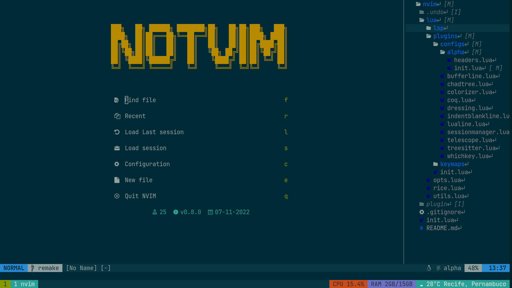
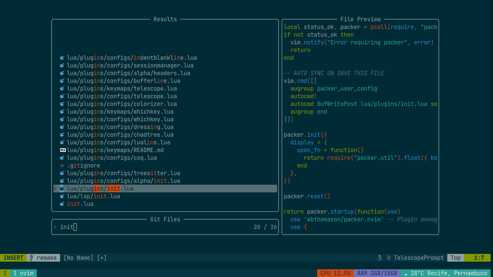
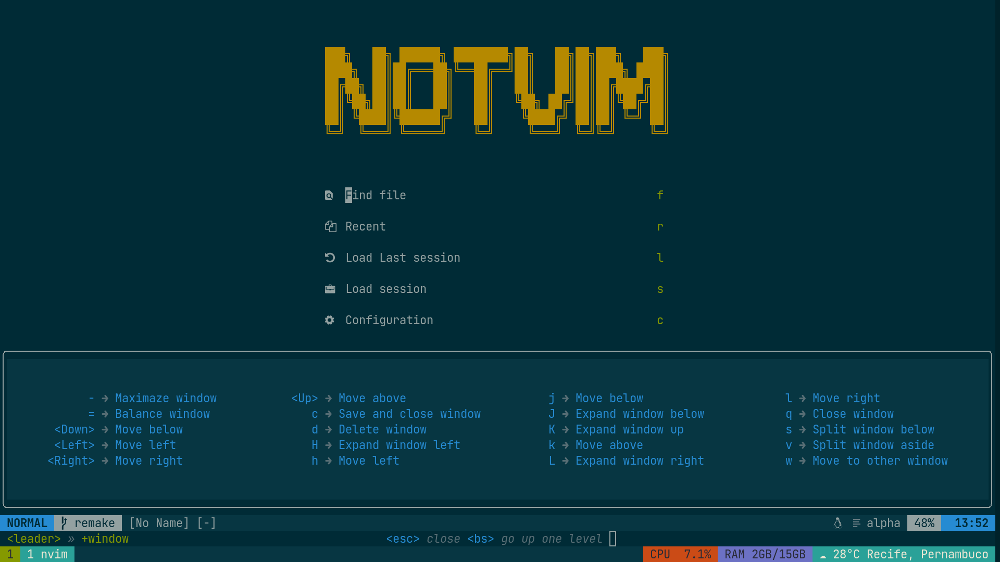

# Notvim
I'm not joking, this is really not *vim*.

## Installation
Nothing fancy here, this is just my config for neovim, just clone the contents of this repo on your ~/.config/nvim.

## Some features

### Alpha:

Highly configurable startpage with multiple shortcuts.
Currently set to: Find files, find recent files, load last session, select session, open the init.lua file, open a empty buffer, quit notvim (really its not vim)

### CHADTree:

File tree plugin, setup to open on the right side by deffault (this prevents the code shifting around on the screen and keeps things on its place)

### Telescope:

Fuzzy find files, text and etc. By default `Ctrl` + `P` will search all files or git files depending on if you are in a git versioned project or not.

### Which key:

Preview keybinds in a small floating window at the bottom of definitely not *vim*

## Plugins
List of all installed plugins

- wbthomason/packer.nvim
- ms-jpq/chadtree
- folke/which-key.nvim
- nvim-treesitter/nvim-treesitter
- nvim-telescope/telescope.nvim
- akinsho/bufferline.nvim
- nvim-lualine/lualine.nvim
- goolord/alpha-nvim
- Shatur/neovim-session-manager
- stevearc/dressing.nvim
- phaazon/hop.nvim
- lukas-reineke/indent-blankline.nvim
- unblevable/quick-scope
- NvChad/nvim-colorizer.lua
- numToStr/Comment.nvim
- gpanders/editorconfig.nvim
- ms-jpq/coq_nvim
- williamboman/mason.nvim
- williamboman/mason-lspconfig.nvim
- neovim/nvim-lspconfig
- dracula/vim
- ellisonleao/gruvbox.nvim
- shaunsingh/nord.nvim
- ishan9299/nvim-solarized-lua
