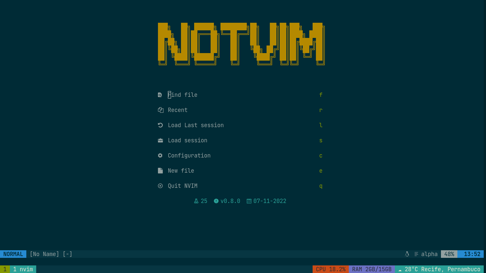

# Notvim
I'm not joking, this is really not *vim*.

## Installation
Nothing fancy here, this is just my config for neovim, just clone the contents of this repo on your ~/.config/nvim.

## Some features

### Alpha:

Highly configurable startpage with multiple shortcuts.
Currently set to: Find files, find recent files, load last session, select session, open the init.lua file, open a empty buffer, quit notvim (really its not vim)

### CHADTree:

File tree plugin, setup to open on the right side by deffault (this prevents the code shifting around on the screen and keeps things on its place)

### Telescope:

Fuzzy find files, text and etc. By default `Ctrl` + `P` will search all files or git files depending on if you are in a git versioned project or not.

### Which key:

Preview keybinds in a small floating window at the bottom of definitely not *vim*

## Plugins
List of all installed plugins

- [wbthomason/packer.nvim](https://github.com/wbthomason/packer.nvim)
- [ms-jpq/chadtree](https://github.com/ms-jpq/chadtree)
- [folke/which-key.nvim](https://github.com/folke/which-key.nvim)
- [nvim-treesitter/nvim-treesitter](https://github.com/nvim-treesitter/nvim-treesitter)
- [nvim-telescope/telescope.nvim](https://github.com/nvim-telescope/telescope.nvim)
- [akinsho/bufferline.nvim](https://github.com/akinsho/bufferline.nvim)
- [nvim-lualine/lualine.nvim](https://github.com/nvim-lualine/lualine.nvim)
- [goolord/alpha-nvim](https://github.com/goolord/alpha-nvim)
- [Shatur/neovim-session-manager](https://github.com/Shatur/neovim-session-manager)
- [stevearc/dressing.nvim](https://github.com/stevearc/dressing.nvim)
- [phaazon/hop.nvim](https://github.com/phaazon/hop.nvim)
- [lukas-reineke/indent-blankline.nvim](https://github.com/lukas-reineke/indent-blankline.nvim)
- [unblevable/quick-scope](https://github.com/unblevable/quick-scope)
- [NvChad/nvim-colorizer.lua](https://github.com/NvChad/nvim-colorizer.lua)
- [numToStr/Comment.nvim](https://github.com/numToStr/Comment.nvim)
- [gpanders/editorconfig.nvim](https://github.com/gpanders/editorconfig.nvim)
- [ms-jpq/coq_nvim](https://github.com/ms-jpq/coq_nvim)
- [williamboman/mason.nvim](https://github.com/williamboman/mason.nvim)
- [williamboman/mason-lspconfig.nvim](https://github.com/williamboman/mason-lspconfig.nvim)
- [neovim/nvim-lspconfig](https://github.com/neovim/nvim-lspconfig)
- [dracula/vim](https://github.com/dracula/vim)
- [ellisonleao/gruvbox.nvim](https://github.com/ellisonleao/gruvbox.nvim)
- [shaunsingh/nord.nvim](https://github.com/shaunsingh/nord.nvim)
- [ishan9299/nvim-solarized-lua](https://github.com/ishan9299/nvim-solarized-lua)
